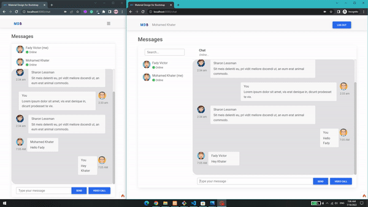

# Tad Chat - chat app
A Simple video/text chat app created with Codeigniter,  WebSocket, WebRTC, and create RESTful API so it can integrate with other platforms

## Table of contents
* [Introduction](#introduction)
* [Technologies](#technologies)
* [Demo](#demo)

## Introduction 
<!--
I created this app because I want to learn more about WebSocket and WebRTC and how to implement them. Another reason is that I want to create an iOS app that is integrated with this web so I created API to make a connection between iOS and the web.
 -->
 I created this app because I want to learn more about WebSocket and WebRTC and how to implement them.
 
## Technologies 
Project created with:
- Codeigniter 4 (PHP 8.0.12)
- WebSocket (Ratchet)
- WebRTC
- JavaScript
- Ajax
- Material Design for Bootstrap

A great resource that explains WebRTC and how it works [here](https://javascript.plainenglish.io/lets-build-a-video-chat-app-with-javascript-and-webrtc-de745072c38c "here") and [here](https://medium.com/dvt-engineering/introduction-to-webrtc-cad0c6900b8e "here")

## Demo 

Video:

  

<!--
Images:

  
  

-->
