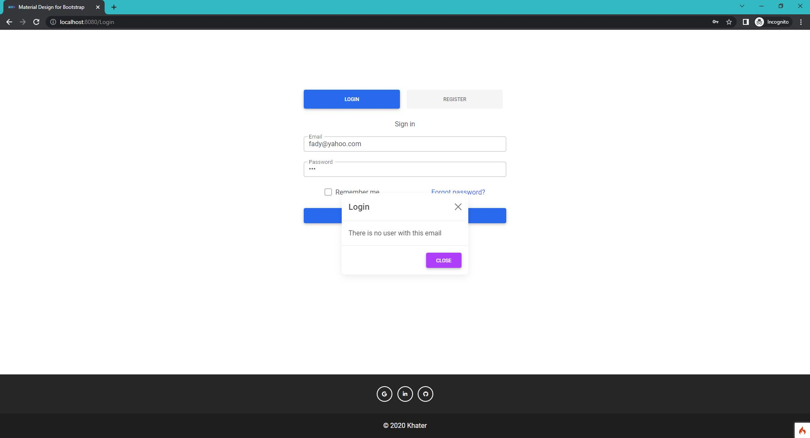

# Tad Chat - chat app
A Simple video/text chat app created with Codeigniter,  WebSocket, WebRTC

## Introduction
I created this app because I want to learn more about  WebSocket and WebRTC and how to implement them another reason is that I want to create an iOS app that is integrate with this web.

## Demo
<p align="center">
  
  
  
  
  
</p>

##Technologies
Project created with:
- Codeigniter 4 (PHP 8.0.12)
- WebSocket (Ratchet)
- WebRTC
- JavaScript
- Ajax
- Material Design for Bootstrap

A great resources that explain WebRTC and how it works [here](https://javascript.plainenglish.io/lets-build-a-video-chat-app-with-javascript-and-webrtc-de745072c38c "here") and [here](https://medium.com/dvt-engineering/introduction-to-webrtc-cad0c6900b8e "here")

## Run Project
if you want to try this project, I have added the database file so you can run without creating new database.

- Download the project from [here](https://github.com/Mohamed-Khaterr/TadChat-Codeigniter4/archive/refs/heads/main.zip)
- Extract project in  `C:\XAMPP\htdocs\TadChat`
- Go to `phpmyadmin` and create new data base with name: `tadchat`
- Import `tadchat.sql` file
- Open the project root folder in terminal then write
```php
php spark serve
```
- Open public folder in terminal and write 
```php
php index.php server index
```
- Open your browser and navigate to [localhost:8080/Login](http://localhost:8080/Login)

Congratulation! Now you can run and test the project, create an email or login with the emails in data. 
